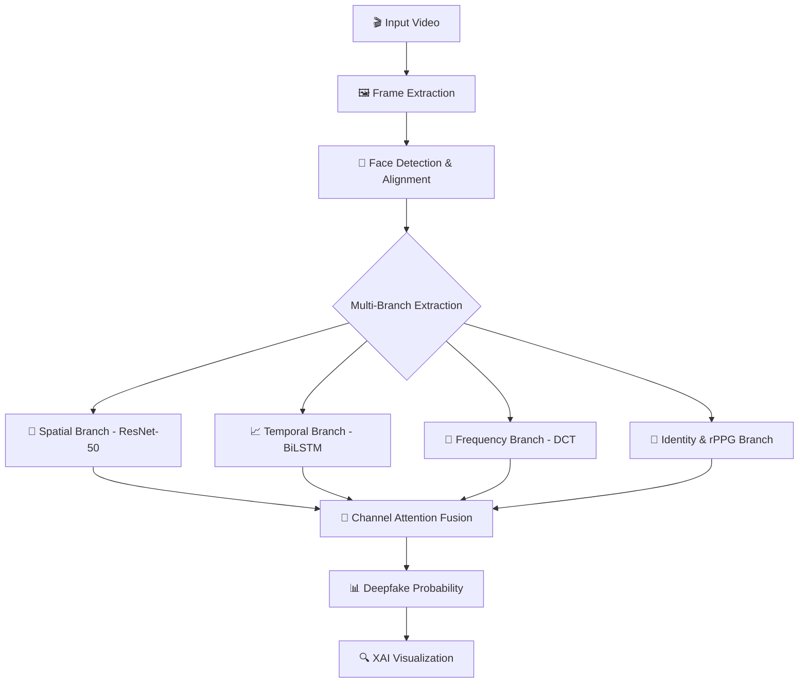

# 🕵️ Deepfake Video Detector

> **AI-powered multi-modal deepfake detection** — An advanced ensemble system combining spatial CNNs, temporal modeling, frequency analysis, and physiological signal detection to expose AI-generated manipulations.

<div align="center">

[](https://www.python.org/)
[](https://pytorch.org/)
[](https://opencv.org/)
[](https://developer.nvidia.com/cuda-toolkit)
[](LICENSE)

</div>

---

## 🌟 Overview

This project implements a state-of-the-art **Multi-Branch Fusion Model** designed to detect deepfakes by looking beyond simple pixel artifacts. It analyzes:
- **Spatial Features**: Frame-by-frame visual consistency.
- **Temporal Dynamics**: Flicker and motion irregularities across time.
- **Frequency Domain**: Micro-structural GAN artifacts via Discrete Cosine Transform (DCT).
- **Identity & Physiology**: Identity consistency across frames and heart rate (rPPG) anomalies.

---

## 🚀 Key Features

- **Multi-Modal Fusion**: Combines 4 distinct feature branches using a learned **Channel Attention** mechanism.
- **High Performance**: Achieved a baseline **AUC of 0.69** on the FF++ dataset (work-in-progress).
- **Explainable AI (XAI)**:
  - **Grad-CAM**: Visualize which parts of a face triggered the "Fake" classification.
  - **Attention Mapping**: Understand which feature branch (e.g., Spatial vs. Frequency) contributed most to a specific decision.
- **GPU Optimized**: Utilizes `Decord` and `MTCNN` for ultra-fast frame extraction and face detection.

---

## 🔬 Detection Architecture



---

## 🛠️ Project Structure

```bash
deepFaceDetection/
├── 📁 models/                 # Multi-branch fusion model & backbones
├── 📁 preprocessing/          # Face extraction & alignment pipeline
├── 📁 feature_extractors/     # DCT, Identity, and Spatial processors
├── 📁 training/               # Optimized training loops (AMP, AdamW)
├── 📁 utils/                  # Explainability (Grad-CAM, Attention)
├── 📁 report/                 # Detailed phase-by-phase documentation
└── 📄 README.md               # You are here!
```

---

## 📈 Roadmap

- [x] **Phase 1-5**: Data pipeline, Frame & Face extraction (RetinaFace).
- [x] **Phase 6-7**: Spatial (ResNet-50) & Temporal (BiLSTM) modeling.
- [x] **Phase 8-10**: Frequency (DCT), Identity (FaceNet), and rPPG (Physiological).
- [x] **Phase 11-12**: Attention Fusion Model & Multi-modal training.
- [x] **Phase 13**: **Explainability Integration (Grad-CAM & XAI).**
- [ ] **Phase 14**: Model Fine-tuning & Optimization.
- [ ] **Phase 15-17**: Backend API, Dashboard & Browser Extension.
- [ ] **Phase 18-19**: Evaluation & Final Presentation.

---

## 🧪 Explainability Example

Want to know *why* the model made a prediction? 

```python
from utils.explainability import DeepfakeExplainer

# Load explainer with trained model
explainer = DeepfakeExplainer("training/best_model.pth")

# Generate Attention weights and Grad-CAM
explainer.visualize_attention("fake/Deepfakes/000_003", feature_roots)
explainer.generate_gradcam("faces/fake/Deepfakes/000_003/frame_0000.jpg")
```

---

## 🤝 Contributing

We are actively improving the model! Feel free to open issues or PRs.

---

## 📄 License

This project is licensed under the MIT License - see the [LICENSE](LICENSE) file for details.

Developed with ❤️ by [roshinit-a](https://github.com/roshinit-a)
